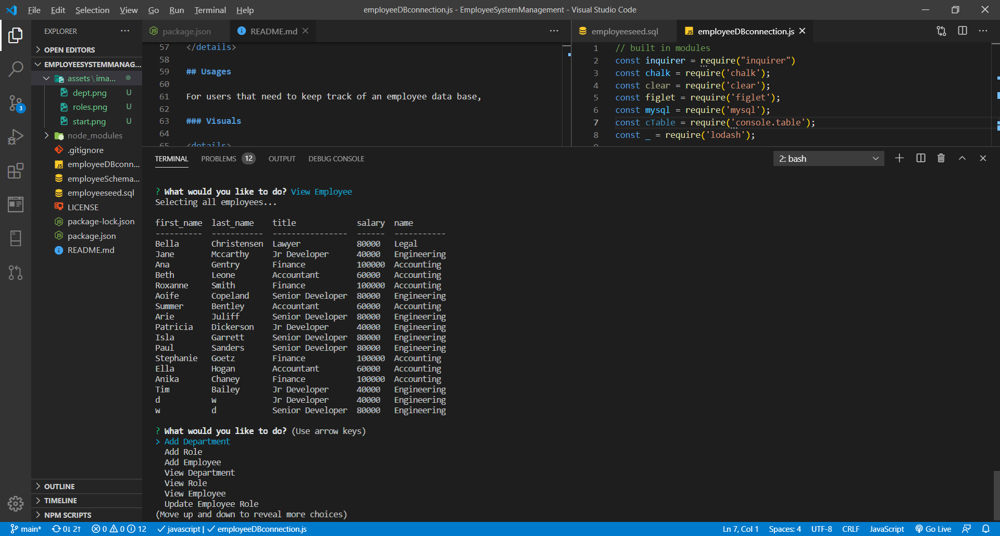

# EmployeeSystemManagement

[Git Hub repo](https://github.com/wyliedavid1984/EmployeeSystemManagement)

## Description 

I created an interface that makes it easier for non-developers to view and interact with information stored in database. Often these interfaces are known as **C**ontent **M**anagement **S**ystems. So I architect and built a solution for managing a company's employees using node, inquirer, and MySQL.

### Table Of Contents

-[Description](#Description)

-[Technologies](#Technologies)
   
-[Usages](#Usages)

-[Visuals](#Visuals)

-[Credits](#Credits)

-[License](#License) 

## Technologies

Expand to see technologies used

## Javascript

### Node

I used node to initialize package.json. After the initialization, I added inquirer, mysql, lodash, console.table, chalk and figlet via NPM.  Also used node to make a connection with the data base.   

### NPM

I used npm to install the dependency express that did most of the heavy lifting for this application. I also installed uuid to help with creating ids. 

#### MYSQL

I use mysql to make a connections to the data base by running it through node. I made several queries to get specific data in each time.  In certain instance I used a for loop and others I used map to display data to the CLI. I also used console.table to display certain sets of data or the response.

#### Inquirer

I used inquirer for all the prompts to the user. I use several types of question to prompt users. I used input, list, and raw list to get number value.

#### Chalk, Figlet

I used these two dependencies to style the start of of the application

#### Console.table

The dependency displays object and other data sets in a cleaner form. I used it specifically for that purpose.

## Usages

For users that need to keep track of an employee data base, 

### Visuals

Screen Shots and Gif with Video link

gif 

Click on the gif to be linked to the video

## Credits

* [Node Documents](https://nodejs.org/api/index.html)
* [npm Documents](https://www.npmjs.com/)
* [Express.js](https://expressjs.com/)
* [Stack Overflow](https://stackoverflow.com/)
* [W3Schools](https://www.w3schools.com/sql/default.asp)

## License

MIT License

Copyright (c) 2020 David Wylie

## Contact

* [David Wylie Github](https://github.com/wyliedavid1984)